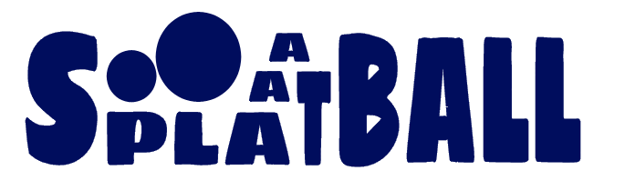

# Splaaatball

<p align="center">
    
</p>

<p align="center" style="font-size:15px;">
🎮🔵 Jeu "Guerre de territoire" implémenté en python pour 2 joueurs. Placez vos pions de couleur pour recouvrir un maximum l'écran et gagner la partie !
</p>
<br>

## ▶️ Exécution

Lancez le fichier **SPLAAATBALL.py**.
```bash
python SPLAAATBALL.py
```

---

## 🛠️ Organisation du programme

- **Fichiers principaux** : 
  - `SPLAAATBALL.py` : code principal.
  - Modules : `COLORS.py`, `DEBUT.py`, `VARIANTES.py`, etc.
- **Graphical User Interface (GUI)** :
  - Menu interactif, boutons cliquables (module `upemtk`).

---

## ⚙️ Variantes disponibles

1. **⏱ Timer** : Limitez le temps par tour (par défaut : 5 secondes).
2. **📊 Score** : Affichez le score en appuyant sur `S`.
3. **⚙️ Choix de taille de boule** : Dépensez vos points pour ajuster la taille de vos boules.
4. **📈 Dynamique** : Les boules grandissent à chaque tour (avec des limites).
5. **🚨 Terminaison** : Terminez la partie dans un nombre limité de tours.
6. **🚧 Obstacles** : Aire de jeu avec des zones interdites.

---

## ✨ Bonus

- **Splaaatomaker** : Créez vos propres obstacles !
- **Pause et sauvegarde** : Reprenez votre partie à tout moment.
- **Personnalisation des couleurs** : Utilisez votre couleur préférée via `CUSTOMCOLOR.py`.

---

## 📜 Droits d'auteur

- **Images et icônes** : Créées avec le logiciel Krita.
- Ressources externes :
  - [Icône coupe](https://www.argentan.fr/marches-publics/attachment/ico_coupe_300px/)
  - [Icône sablier](https://www.flaticon.com/fr/icone-gratuite/sablier_1046401)
- **Python 3** : [Télécharger ici](https://www.python.org/downloads/)

---

## ⚙️ Petit plus

La branche `revived` est une version optimisée du jeu pour améliorer les performances (cependant cela nécessite l'installation de certains modules).

---

**Profitez du jeu et amusez-vous !** 🎉
